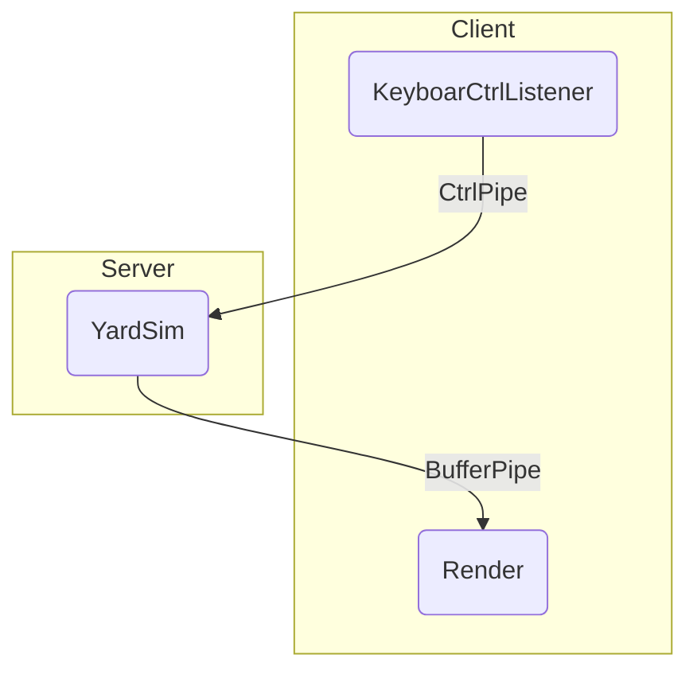
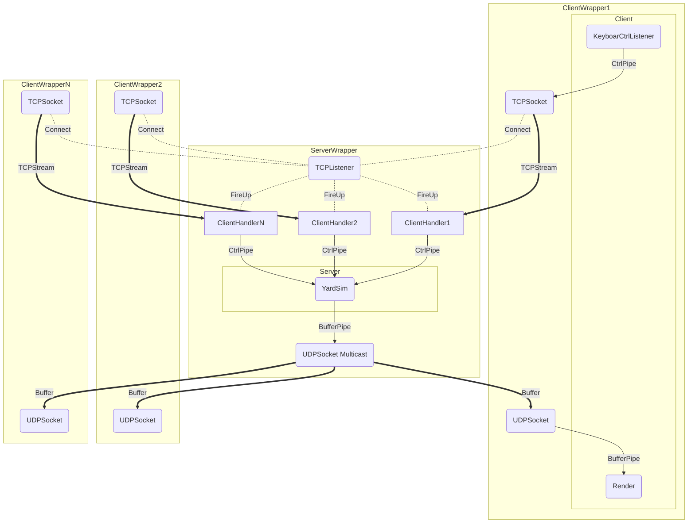

Github repository: [SocketSnake](https://github.com/James-Hen/SocketSnake)

## Why snake

I started this Rust project days ago before my assignment for computer networks was due. And also, I though that I shall practice coding after reading half through the book [Programming Rust by Jim Blandy, Jason Orendorff](https://www.oreilly.com/library/view/programming-rust/9781491927274/). Then the snake was born out of nowhere.

The project is build for personal practice, especially around networks and rust features. Nevertheless, We shall consider if someone would acually play it, right? Or a step forward, if somebody would learn from the project? Thus I write this blog in case of oblivion.

## The structure of the project

Everything starts from a easy ground. For building a local version of the game, while considering that it may be migrated to a networked version, we implements a  `Client` thread and a `Server` thread. The `Client` thread is responsible for listening a keyboard action, and convert then into a `Ctrl` signal (which is a `enum` type), and send it to the `Server` with a `std::mpsc` channel; The `Server` thread will host an instance of the game (`YardSim`), and push the screen buffer `YardBuf` (which is a `Vec<Vec<TUIBlock>>`) to the `Client`, who is in charge of rendering the game.



Moreover, to implement the multiplayer game via network, we shall develop more modules. The `ServerWrapper` thread consists the `Server` thread, so do the `ClientWrapper` do.



In the diagram, the squared blocks are threads, and round-cornered squares are objects. The bol lines are network channels, and the regular lines are inter-thread channels. The server wrapper has a `TCPListener`: whenever the server listened a connection request, it launches a `ClientHadler` thread to deal with the TCP stream, and send the control signals to the server backend through a channel. The client then receive the buffer through UDP, and send it for rendering.

The chioce of a mixure of TCP and UDP is due to the different demands: the control signals need to be sent losslessly and orderly, but the buffer cares more about latency than loosing packets.

### Files

The files implementing the project are listed below.

```bash
SocketSnake
├── Cargo.toml			# provides definition for Rust's Cargo utility
└── src
    ├── client.rs		# User interface, game control threads implementation
    ├── main.rs			# Main
    ├── multiplayer.rs	# Server and client wrappers to introduce sockets and channels
    ├── render.rs		# Defined some ui rendering components and utilities
    ├── server.rs		# Game simulation thread implementation
    ├── snakeux.rs		# Defines the user interaction that improves user's experience
    ├── transmit.rs		# Defined some network transmitting components and utilities
    └── yard.rs			# Snake game rule implementation, simulate step by step in ticks
```